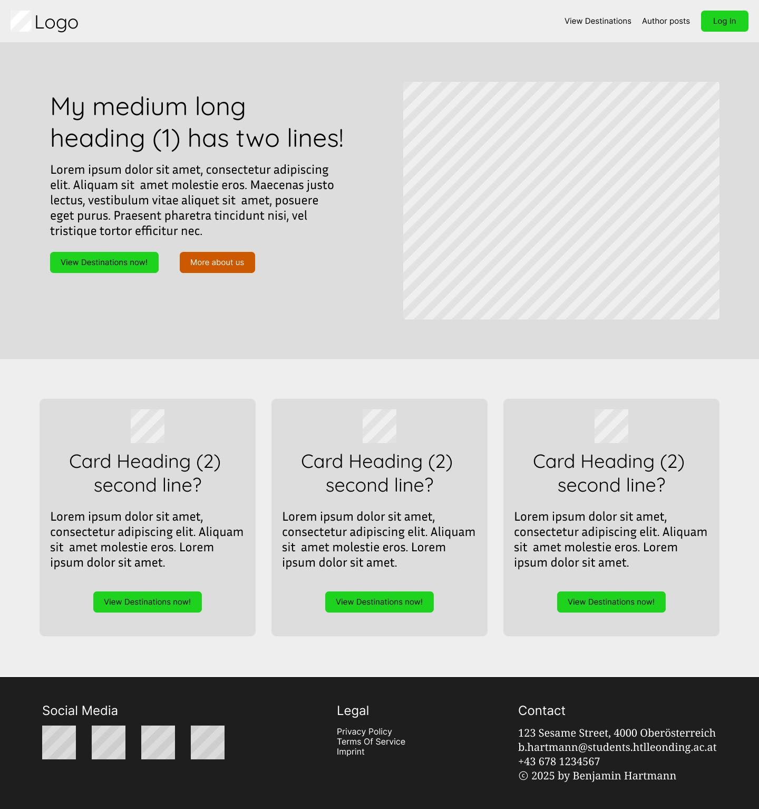

# Webseite Sommerprojekt 2024/25

Hartmann Benjamin, 1AHITM

Medientechnik Webtechnologien, Sommersemester 2024/25

## Thema

Mein Thema ist eine Reiseblog-Webseite. Diese werde ich mit Inhalten meiner letzten Reisen füllen. Außerdem möchte ich sie diesen Sommer weiterverwenden.

## Design & Layout

Ich möchte diese Website mit Fokus auf Leserfreundlichkeit gestalten. Dies inkludiert variable Schriftgrößen und Hintergründe bem Lesen der Einträge.

### Farben & Schriftarten

* Text/Hintergrund: Schwarz/Weiß bzw. helles/dunkles Grau
* Primärfarbe Grün (#1dd31d)
* Sekundärfarbe Orange (#cc5800)
* Akzentfarbe Blau (#2500cc)
* Quicksand für Überschriften
* Inria Sans für Textkörper

### Zielpersonen

Zielpersonen sind vor allem Familie und Freunde, da ich sie über unsere Reise live informiert halten will.

### Design-Inspiration, Vorstellungen

* Parallax-Effekte
* Interaktive / Animierte Bausteine
* Ausgeglichene Abstände
* Schnelle Ladezeiten

### Seitenhierachie

#### Startseite

Die Startseite preist den Inhalt an. Zusätzlich sind hier **Navigationslinks** zur Reiseauswahl und zum Login. Als Autor sieht man hier auch einen Link zum Post-Upload

#### Seite 1: Auswahl

Es gibt eine "Reise-Auswahl", die den Nutzer entscheiden lässt, welche Reise (Land, Jahr) er ansehen möchte. Hier wird auf die Multi-Seiten verlinkt.

#### Seite 2: Multi

Eine Multi-Post Seite, die die Posts ansprechend auflistet. Hier wird auf die Single-Posts verlinkt.

#### Seite 3: Post

Eine Seite, welche _einen_ Post ansprechend und leserfreundlich darstellt.

#### Seite 4: Login

Für den Seitenadministrator und Autoren sollen zusätzliche Seiten sichtbar werden. Dazu gibt es ein Login-Formular.

#### Seite 5: Post-Upload

Hier können Autoren Posts im Markdown-Format hochladen. Evtl. Online-Editor

### Moodboard

[Moodboard auf realtimecolors.me](https://www.realtimecolors.com/?colors=000000-ffffff-2ce22c-5833ff-ff8b33&fonts=Quicksand-Inria%20Sans)
